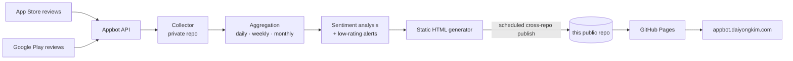

# Kia Access — Review Digest

Automated **App Store + Google Play review digest** for the Kia Access mobile app.
It rolls up user reviews into daily, weekly, and monthly reports — with rating
trends, star-distribution breakdowns, sentiment analysis, and *"attention needed"*
alerts for low-rated feedback.

🔗 **Live dashboard:** https://appbot.daiyongkim.com

---

## What it does

- **Collects** reviews from the App Store and Google Play (US storefronts) via the Appbot API
- **Aggregates** into daily / weekly / monthly rollups: average rating, review volume, star distribution, and low-rating counts
- **Analyzes sentiment** and surfaces an *"Attention needed"* section that highlights recurring complaints (crashes, connectivity, performance, subscriptions)
- **Tracks developer responses** alongside each featured review
- **Publishes** a fast, static dashboard to GitHub Pages — no backend, no database, no login

---

## Architecture

The data pipeline runs in a **separate private repository** on a schedule. This
public repository holds only the **generated static output** that GitHub Pages serves.



**Why split into two repos?** The collection/processing logic and API credentials
stay private, while only the harmless published artifact is public — so the live
site can be shared freely without exposing the pipeline or any secrets.

---

## Tech stack

| Layer | Choice |
|-------|--------|
| Data source | Appbot API (App Store + Google Play reviews) |
| Processing | Python (scheduled, private repo) |
| Automation | GitHub Actions — scheduled cron + cross-repo publish |
| Hosting | GitHub Pages, custom domain via `CNAME` |
| Output | Static HTML (no runtime server, no database) |

---

## Repository layout

```
.
├── index.html          # Landing digest (latest daily / weekly / monthly view)
├── d/
│   └── YYYY-MM-DD.html  # Per-day snapshot archive (236+ days and counting)
├── CNAME               # Custom domain: appbot.daiyongkim.com
└── .nojekyll           # Serve files as-is (skip Jekyll processing)
```

Snapshots currently span **2025-11-23 → present**, refreshed automatically.

---

## Notes

- Independent, personal engineering project. **Not affiliated with, endorsed by, or
  operated on behalf of Kia.** It uses publicly available app-review data purely to
  demonstrate an automated review-monitoring pipeline.
- The dashboard is read-only and updates on a schedule; there is no user input or
  account system.

## Author

**Daiyong Kim** — Senior Software Engineer
Portfolio: https://daiyongkim.com
